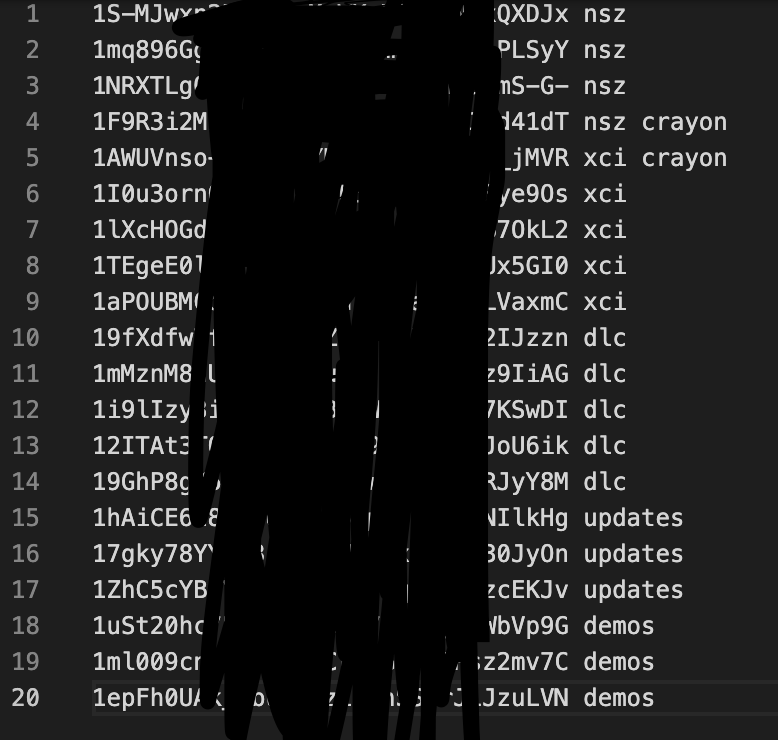
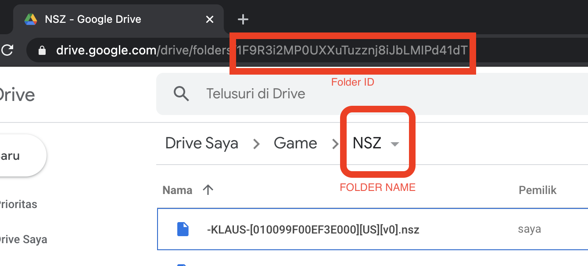

# Tinfoil Server using PHP

This script only for Google drive link, not serving files.

based on [this documentation](https://blawar.github.io/tinfoil/custom_index/)

## INSTALATION
sample on **tabel.sql**

- upload to server
- create mysql database, or just choose sqlite
- import **tabel.sql**
- copy **config.example.php** to **config.php**
- copy **.htaccess.example** to **.htaccess**
- edit **config.php** based mysql database
- chmod recursive 777 **cache/** and **data/**
- run **`composer install`**
- using phpmyadmin, start adding file id from google drive, or use [google drive API](https://developers.google.com/drive/api/v2/reference/files/list), read on [stackoverflow](https://stackoverflow.com/questions/24720075/how-to-get-list-of-files-by-folder-on-google-drive-api)
- folder **cache/**, **data/**, **import/token/**, and **import/cache/** must writeable

if you enable login **$must_login = false;** you must use SMS Server or WhatsApp server. username is phone number, and pasword anything, it will send real password by sms.

## DOCKER

- copy **config.example.php** to **config.php** and edit it
- run `docker-compose up`
- it will start download game data
- port will open on 8880

## Import games from Google drive with your own credentials

all script need to run from command line, except Google login. need to run from browser.

[How to setup google drive client](https://www.iperiusbackup.net/en/how-to-enable-google-drive-api-and-get-client-credentials/), and put it on config.php, just change $client_id and $client_sc

- access from browser `http:// domain/import/login.php` to login drive, check inside token folder if it exists.
- **`cd import/`** go to folder import from command line
- **`php importGameData.php`** run it first, to download game data.
- copy **`folder.example.txt`** to **`folder.txt`**
- start adding Folder ID to **`folder.txt`**

- run **`php drive2db.php`** it will start importing file id from google drive
- now add url to tinfoil in your switch

## Import games from folder

- **`file2db.php`** will scan game inside folder **`data/games`** to database. you can upload your games file to this folder,

## other files

run it from browser

- **clean.php** is to clean cached data if you update the games
- **pull.php** to pull latest source code, if you clone from git
